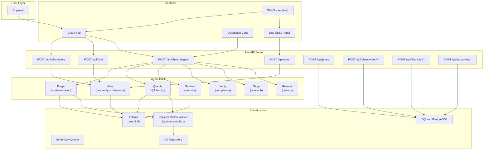
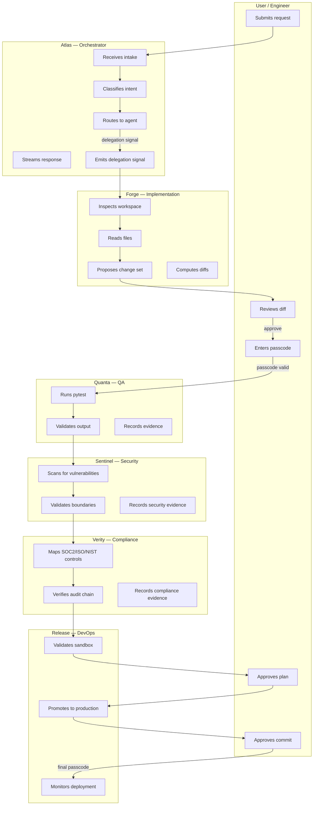
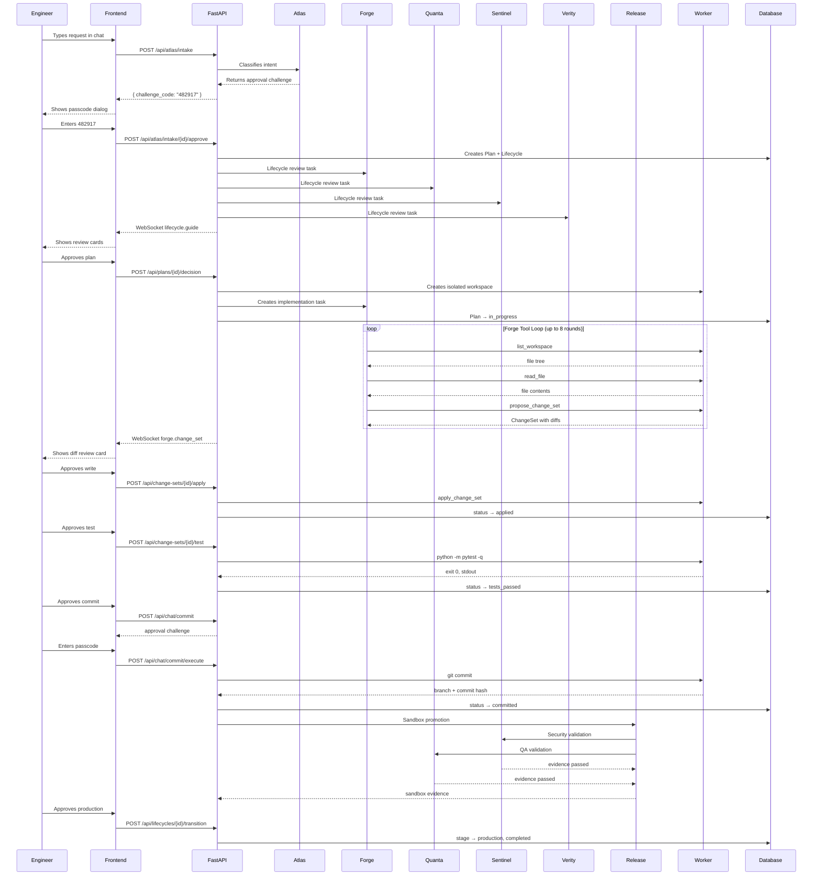
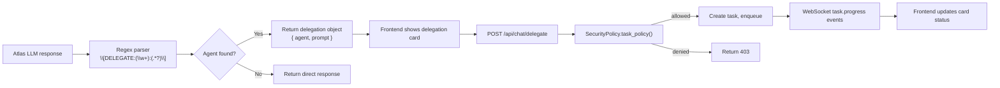
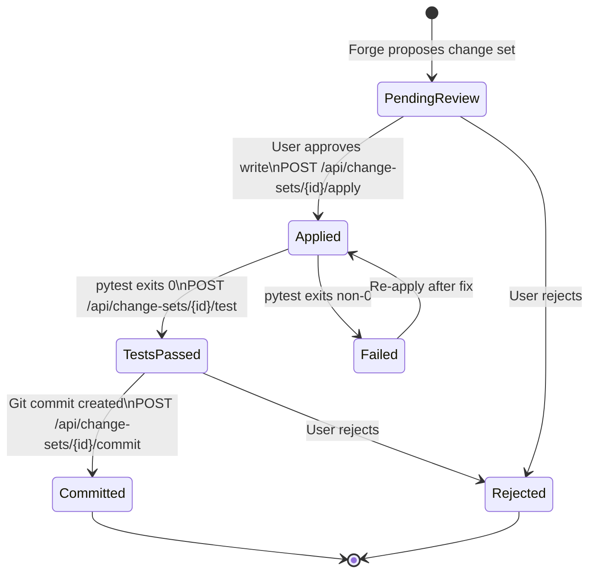
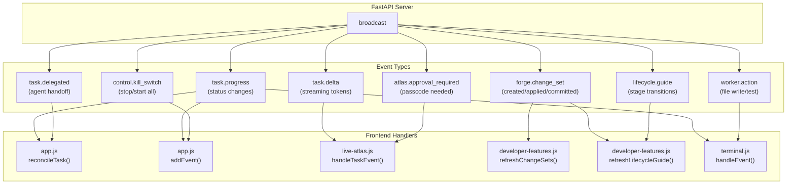
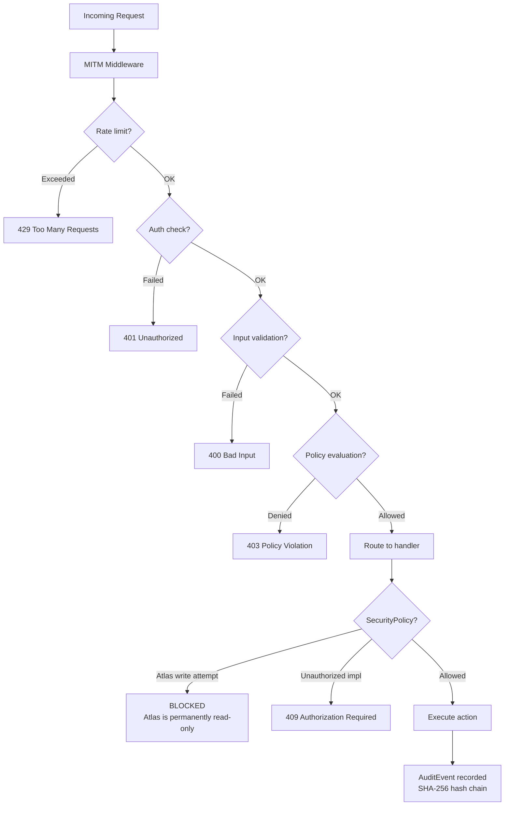
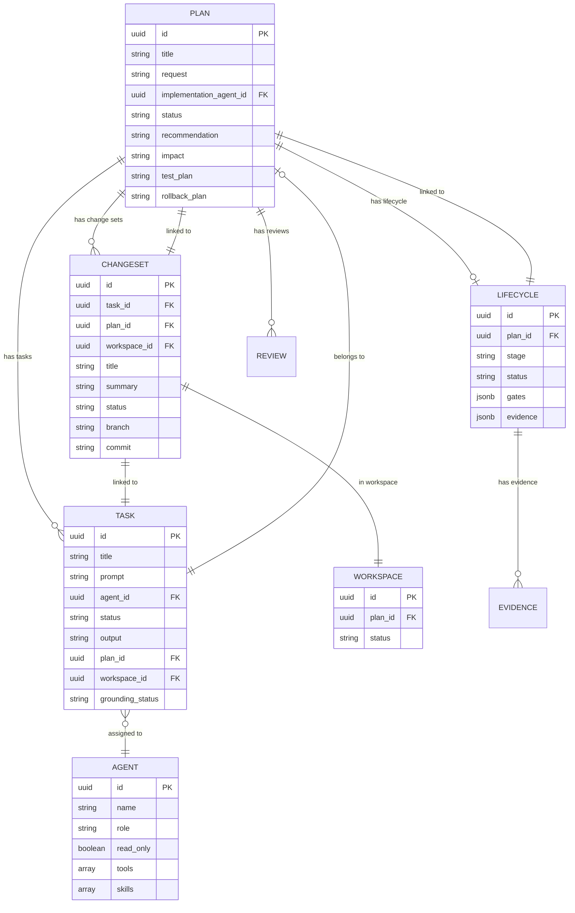

# Atlas Studio — Delegation Architecture

End-to-end reference for how user requests flow through the governed multi-agent system, from intake to production commit.

---

## 1. System Overview



---

## 2. Vertical Swimlane — Agent Responsibilities



---

## 3. End-to-End Request Lifecycle



---

## 4. Delegation Signal Mechanism

Atlas communicates delegation via a structured text signal embedded in its LLM response:

```
[DELEGATE:Forge:Implement a dark mode toggle in the settings panel]
```

### Signal Flow



### Agent Routing Table

| Signal Agent | Actual Agent | Capability | Required Approval |
|-------------|-------------|-----------|-------------------|
| `Forge` | Forge | Implementation, file writes, code execution | Yes (`user_authorized=true`) |
| `Quanta` | Quanta | QA testing, test execution | Yes |
| `Sentinel` | Sentinel | Security scanning, boundary validation | Yes |
| `Verity` | Verity | Compliance review, SOC2/ISO/NIST | Yes |
| `Sage` | Sage | Research, web search (via SearXNG) | Conditional |
| `Release` | Release | DevOps, deployment, monitoring | Yes |

---

## 5. Approval Gates — Every Decision Point

```mermaid
flowchart TD
    START["User Request"] --> INTAKE["Plan Intake\nPOST /api/atlas/intake"]
    INTAKE --> CHALLENGE1["6-digit passcode\n5-min TTL, 5 attempts"]
    CHALLENGE1 --> PLAN["Plan Created\nstatus: pending_approval"]
    PLAN --> REVIEWS["Agent Reviews\nForge, Sage, Sentinel,\nBlueprint, Verity"]
    REVIEWS --> APPROVE_PLAN["User Approves Plan\nPOST /api/plans/{id}/decision"]
    APPROVE_PLAN --> WORKSPACE["Isolated Workspace\ncreated via Worker"]
    WORKSPACE --> FORGE_IMPL["Forge Implements\nChange Set proposed"]
    FORGE_IMPL --> DIFF_REVIEW["User Reviews Diff\nPOST /api/change-sets/{id}/apply"]
    DIFF_REVIEW --> CHALLENGE2["6-digit passcode"]
    CHALLENGE2 --> WRITE["Write Applied\nstatus: applied"]
    WRITE --> TEST_APPROVE["User Approves Test\nPOST /api/change-sets/{id}/test"]
    TEST_APPROVE --> CHALLENGE3["6-digit passcode"]
    CHALLENGE3 --> TEST["pytest Run\nstatus: tests_passed"]
    TEST --> COMMIT_APPROVE["User Approves Commit\nPOST /api/chat/commit"]
    COMMIT_APPROVE --> CHALLENGE4["6-digit passcode"]
    CHALLENGE4 --> COMMIT["Git Commit\nstatus: committed"]
    COMMIT --> SANDBOX["Sandbox Validation\nSentinel + Quanta"]
    SANDBOX --> PROD_APPROVE["User Approves Production\nPOST /api/lifecycles/{id}/transition"]
    PROD_APPROVE --> CHALLENGE5["6-digit passcode"]
    CHALLENGE5 --> PRODUCTION["Production Deployed\nstage: production"]

    style CHALLENGE1 fill:#1a3a4a,stroke:#4ae68a,color:#b9dce6
    style CHALLENGE2 fill:#1a3a4a,stroke:#4ae68a,color:#b9dce6
    style CHALLENGE3 fill:#1a3a4a,stroke:#4ae68a,color:#b9dce6
    style CHALLENGE4 fill:#1a3a4a,stroke:#4ae68a,color:#b9dce6
    style CHALLENGE5 fill:#1a3a4a,stroke:#4ae68a,color:#b9dce6
```



---

## 6. Change Set Lifecycle



### ChangeSet Fields

| Field | Description |
|-------|-------------|
| `id` | UUID — unique identifier |
| `task_id` | Linked Forge task |
| `plan_id` | Linked Plan |
| `workspace_id` | Isolated workspace |
| `title` | Human-readable title |
| `summary` | What changed and why |
| `files[]` | Array of `ChangeSetFile` (path, before_sha256, after_sha256, diff) |
| `combined_diff` | Full unified diff |
| `status` | pending_review → applied → tests_passed → committed |
| `test_result` | { exit_code, stdout, stderr } |
| `branch` | Git branch name (atlas/...) |
| `commit` | Git commit hash |

---

## 7. Lifecycle Stages — The 10-Stage Pipeline

```mermaid
graph LR
    subgraph Stage1["1. Request"]
        S1A[User submits change request]
    end
    subgraph Stage2["2. Recommendation"]
        S2A[Forge proposes solution]
    end
    subgraph Stage3["3. Reviews"]
        S3A[Forge, Sage, Blueprint,\nSentinel, Verity review]
    end
    subgraph Stage4["4. Authorization"]
        S4A[User approves plan\nwith passcode]
    end
    subgraph Stage5["5. Implementation"]
        S5A[Forge creates change set\nin isolated workspace]
    end
    subgraph Stage6["6. Diff Review"]
        S6A[User reviews combined diff\napproves file write]
    end
    subgraph Stage7["7. Test"]
        S7A[Quanta runs pytest\nrecords evidence]
    end
    subgraph Stage8["8. Sandbox"]
        S8A[Sentinel + Quanta\nvalidate in sandbox]
    end
    subgraph Stage9["9. Production"]
        S9A[User authorizes\nproduction promotion]
    end
    subgraph Stage10["10. Monitoring"]
        S10A[Release + Sentinel\nmonitor deployment]
    end

    Stage1 --> Stage2 --> Stage3 --> Stage4 --> Stage5 --> Stage6 --> Stage7 --> Stage8 --> Stage9 --> Stage10
```



### Stage Evidence Requirements

| Stage | Required Evidence | Required Approval |
|-------|------------------|-------------------|
| Development | Implementation task completed | No |
| Test | Test or security evidence passed | No |
| Sandbox | Sandbox evidence from Sentinel + Quanta | No |
| Production | Sandbox evidence + user authorization | Yes (`production_promotion`) |

---

## 8. WebSocket Event Map



---

## 9. Security Enforcement



### Key Security Rules

| Rule | Enforcement |
|------|-------------|
| Atlas is permanently read-only | `SecurityPolicy.validate_agent_tools()` rejects mutating tools on Atlas |
| Implementation requires authorization | `requires_user_authorization=true` enforced at API level |
| External providers blocked | Model names validated against SSRF; openai/anthropic/ etc. rejected |
| All approvals are single-use | `ApprovalService.consume()` marks as `used` after validation |
| Passcodes expire in 5 minutes | HMAC digest with TTL, max 5 attempts |
| Workspace is isolated | Each plan gets a dedicated workspace; no cross-plan access |
| Audit trail is tamper-evident | SHA-256 hash chain linking every event to its predecessor |

---

## 10. API Endpoint Reference

### Chat & Delegation

| Method | Path | Purpose |
|--------|------|---------|
| `POST` | `/api/chat` | Direct chat with Atlas (streams response, detects delegation) |
| `POST` | `/api/chat/delegate` | Execute delegated task to named agent |
| `POST` | `/api/chat/commit` | Initiate change set commit (returns approval) |
| `POST` | `/api/chat/commit/execute` | Execute commit after approval |

### Intake & Plans

| Method | Path | Purpose |
|--------|------|---------|
| `POST` | `/api/atlas/intake` | Intake user request; creates approval |
| `POST` | `/api/atlas/intake/{id}/approve` | Approve intake; creates Plan + reviews |
| `POST` | `/api/plans` | Create plan request (queues reviews) |
| `POST` | `/api/plans/{id}/decision` | Approve/reject plan (creates workspace + Forge task) |

### Change Sets

| Method | Path | Purpose |
|--------|------|---------|
| `GET` | `/api/change-sets` | List change sets |
| `POST` | `/api/change-sets/{id}/apply` | Apply change set (requires approval) |
| `POST` | `/api/change-sets/{id}/test` | Run tests (requires approval) |
| `POST` | `/api/change-sets/{id}/commit` | Git commit (requires approval) |
| `DELETE` | `/api/change-sets/{id}` | Soft-delete change set |

### Lifecycles

| Method | Path | Purpose |
|--------|------|---------|
| `GET` | `/api/lifecycles` | List all lifecycles |
| `POST` | `/api/lifecycles/{id}/transition` | Advance lifecycle stage |
| `POST` | `/api/lifecycles/{id}/override` | Override lifecycle (requires approval) |
| `GET` | `/api/lifecycle-guide` | Full lifecycle guide with stages |

### Approvals

| Method | Path | Purpose |
|--------|------|---------|
| `POST` | `/api/approvals` | Request protected action approval |
| `POST` | `/api/approvals/{id}/decision` | Decide (approve/reject) with passcode |

### WebSocket

| Method | Path | Purpose |
|--------|------|---------|
| `WS` | `/api/ws` | Real-time event stream |

---

## 11. Data Model Relationships


